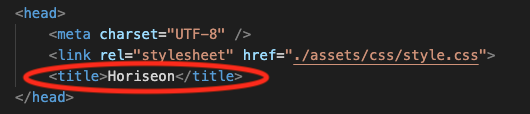

# Horiseon Refactoring

## Description:

I have improved the Horiseon's website coding, without changing what it does. Multiple elements for the HTML file were changed to semantic elements for easier readability.
Furthermore, a website title was added, and certains links on the nav were properly linked to their designated sections of the HTML, and alt text was added to all images, for user accessibility. 
Lastly, a `.root{}` was added to the CSS style sheet to avoid having to type repeating colors into the code. 

The following changes were made accordingly:

**////////////////////////////////////////////////////////////////////////////////////////////////////////**
##  1. Website title was added:

**////////////////////////////////////////////////////////////////////////////////////////////////////////**
 ## 2. Multiple div elements were changed to semantic elements:

**////////////////////////////////////////////////////////////////////////////////////////////////////////**
## 3. Links on the nav bar were associated to the corresponding `id` of the code:

**////////////////////////////////////////////////////////////////////////////////////////////////////////**
## 4. Semantic element `<footer>` was added:

**////////////////////////////////////////////////////////////////////////////////////////////////////////**

## 5. `.root` was added to the CSS style sheet, to lessen code repetition:

